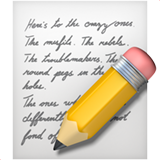
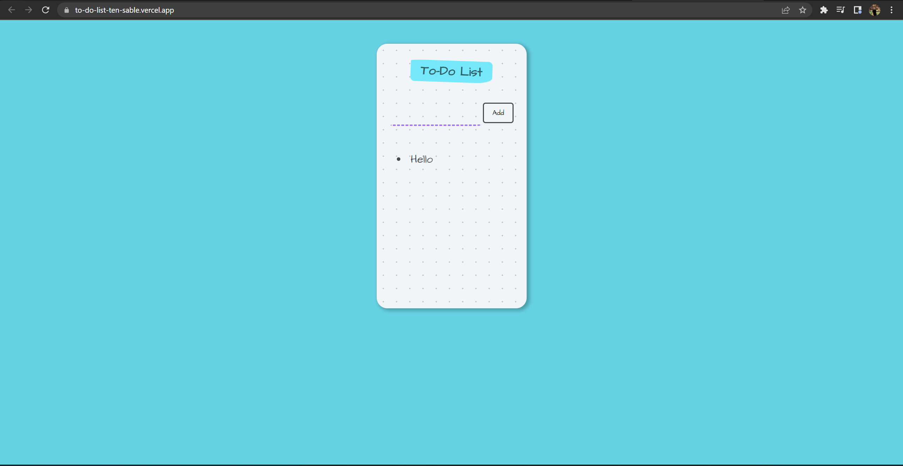
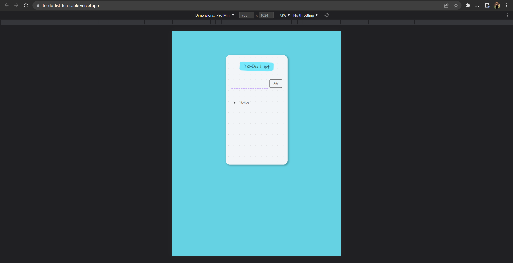
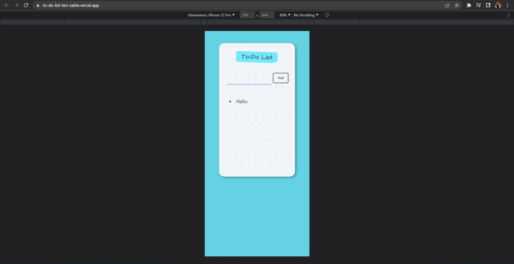
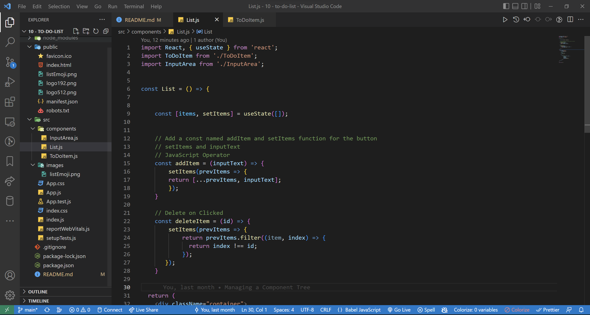

<!-- markdownlint-configure-file {
  "MD013": {
    "code_blocks": false,
    "tables": false
  },
  "MD033": false,
  "MD041": false
} -->

  

# To Do List

This is the To Do List React Project on Udemy - Web Development Bootcamp 2022

It is made with React JS utilizing the State Hook and Props in React. List that!
📝

## Website

🖥️ [https://to-do-list-ten-by-johncanero.vercel.app/]

✍️ Project by John Cañero

## Responsive Design

🪟: [Desktop - Tablet - Mobile]

